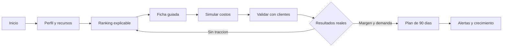

# Business Vision AI: plan de producto y operacion

## 1. Proposito

Business Vision AI lleva a una persona desde "no se que puedo hacer" hasta un experimento comercial medible, de bajo riesgo y con acompanamiento. Cada recomendacion debe distinguir tres niveles:

- `Oportunidad`: existe una necesidad plausible y evidencia fechada.
- `Prueba`: acciones pequenas para validar clientes, costos, permisos y margen.
- `Negocio`: solo se declara viable tras resultados registrados por el usuario.

No se muestran ganancias garantizadas, proveedores inventados ni "tendencias" sin fuente y fecha.

## 2. Decision tecnologica

El MVP entregado es una PWA responsive porque puede probarse hoy en telefonos y computadoras, instalarse desde el navegador y publicarse con costo minimo. Permite validar uso y conversion antes de pagar una aplicacion nativa.

Arquitectura objetivo:

| Capa | Eleccion | Motivo |
| --- | --- | --- |
| Cliente MVP | PWA HTML/CSS/JavaScript | Primer uso inmediato, accesibilidad y despliegue sencillo |
| Cliente fase 2 | React Native con Expo Web | Apps nativas y web con componentes compartidos cuando exista traccion |
| Backend | Supabase | PostgreSQL, autenticacion, almacenamiento, funciones y seguridad por fila |
| IA | OpenAI Responses API con salidas estructuradas | Planes JSON validables, herramientas y trazabilidad |
| Analitica | Eventos anonimizados + panel de embudo | Medir validacion y progreso, no solo chats |
| Pagos | Proveedor disponible por pais | Suscripcion y creditos con comprobantes locales |

La API de IA vive en funciones del backend; la clave nunca debe incluirse en la aplicacion.

## 3. Pantallas y flujo

Mapa de pantallas:

| Pantalla | Objetivo | MVP |
| --- | --- | --- |
| Inicio / propuesta | Explicar confianza y comenzar | Implementada |
| Onboarding accesible | Capturar realidad, recursos y limites | Implementada |
| Radar | Ordenar oportunidades y explicar ajuste | Implementada |
| Ficha de negocio | Costos, pasos, ventas, marca, IA y riesgos | Implementada |
| Comparador | Comparar costo, velocidad y automatizacion | Implementada |
| Simulador | Cambiar ventas/costos y observar margen | Implementada |
| Roadmap | Checklist de validacion y 30/90 dias | Implementada |
| Mentor | Consultas sobre la opcion elegida | Demostracion guiada |
| Opina | Checklist y feedback inicial de usuarios | Implementada |
| Alertas de mercado | Cambios fechados y relevantes por perfil | Fase 2 |
| Premium / pagos | Suscripcion, creditos y mentor avanzado | Fase 2 |

Flujo principal:



Modo desde cero usa lenguaje simple, glosario contextual, tareas pequenas y advertencias. Modo profesional habilita embudos, automatizaciones, metricas, delegacion y expansion; no altera los controles de riesgo.

## 4. Sistema de recomendaciones

### Perfil minimo

Edad, pais/ciudad, presupuesto, meta economica, disponibilidad, situacion, estudios, experiencia, objetivo de ingreso, formato, riesgo, comodidad vendiendo, forma de trabajo, personalidad, intereses, habilidades y dispositivos.

La edad solo adapta accesibilidad, canales y explicacion; nunca debe excluir oportunidades.

### Requisitos de una oportunidad

Una oportunidad publicada requiere:

- problema y segmento de cliente;
- modelo de cobro y unidad economica;
- inversion piloto y alternativa low cost;
- requisitos o advertencias legales/sanitarias por pais cuando apliquen;
- fuente de tendencia fechada;
- proceso de validacion, criterios para detenerse y riesgos;
- tareas automatizables sin comprometer privacidad.

### Puntaje

El MVP calcula un puntaje de ajuste, no una prediccion de exito:

| Factor | Peso maximo | Regla |
| --- | ---: | --- |
| Presupuesto piloto | 18 | Penaliza fuertemente si la persona no puede iniciar sin deuda |
| Formato deseado | 9 | Digital, local o hibrido |
| Habilidad util | 13 | Premia experiencia transferible; sin ella recomienda aprender |
| Dispositivo requerido | 6 / -15 | Bloquea digital si falta acceso esencial |
| Tiempo disponible | 7 / -12 | Protege de cargas inviables |
| Riesgo | -10 | Penaliza riesgo medio ante tolerancia baja |
| Objetivo y escalabilidad | 4 | Solo como desempate |

Fase 2 agrega subpuntajes visibles:

- `fit_personal` 30%: recursos, tiempo y habilidades.
- `viabilidad_local` 25%: precios, competencia, requisitos y demanda fechados.
- `economia` 20%: margen conservador, recuperacion y recurrencia.
- `resiliencia` 15%: complementariedad humana, demanda estructural y diversificacion.
- `escalabilidad_responsable` 10%: procesos, automatizacion y canales.

Se degrada el ranking si la evidencia local expira, el margen es negativo, falta permiso critico o el usuario reporta pruebas fallidas.

## 5. Modo negocio guiado

Cada negocio generado debe incluir en un objeto estructurado:

- Nombre, explicacion, cliente, potencial, dificultad, tendencia y fuente.
- Inversion low cost/profesional, lista de compras priorizada, costo unitario y escenario de precio.
- Proveedores por buscar, nunca inventados; la app muestra criterios y enlaces verificados.
- Procesos o recetas cuando aplican, con higiene, conservacion, alergenos y reglas locales.
- Plan de primeras ventas en WhatsApp, redes, comunidad y referidos.
- Nombres de marca, slogan, paleta y concepto visual.
- Automatizaciones seguras y tareas que requieren revision humana.
- Checklist 30 dias, metas 90 dias, errores, criterios para detener o escalar.

Por ejemplo, comida siempre exige advertencia sanitaria y validacion local; cuidado de mayores siempre diferencia acompanamiento de atencion medica; IA siempre exige consentimiento y privacidad.

## 6. IA interna

La IA no decide sola que un negocio "funciona". Recibe catalogo curado, perfil minimizado y evidencia recuperada por el backend. Devuelve JSON validado; una capa determinista recalcula costos y puntajes.

### Agentes logicos

| Funcion | Entrada | Salida |
| --- | --- | --- |
| Perfilador | Respuestas del usuario | Restricciones, fortalezas, explicacion simple/pro |
| Recuperador de evidencia | Pais, categoria, fecha | Fuentes, vigencia, confianza |
| Disenador de pruebas | Oportunidad + perfil | Experimento de bajo costo y checklist |
| Mentor | Progreso y dudas | Siguiente accion, riesgos y motivacion |
| Monitor | Evidencia nueva | Alerta si cambia el ranking |

### Prompt del recomendador

```text
Eres el motor responsable de Business Vision AI.
Objetivo: proponer pruebas de negocio posibles para esta persona, no prometer exito.
Usa solamente oportunidades y evidencia incluidas en el contexto.
Reglas:
1. Rechaza ingresos garantizados y senala supuestos del escenario.
2. Prioriza inicio sin deuda, permisos, seguridad y validacion con compradores.
3. Si faltan datos locales, marca requires_local_validation=true.
4. Para alimentos, cuidado, salud, finanzas o datos personales incluye salvaguardas.
5. Explica en lenguaje {mode} por que cada opcion encaja o no.
Devuelve JSON conforme a OpportunityRecommendationSchema.
```

### Prompt del mentor

```text
Actua como mentor practico y respetuoso. Usa el negocio seleccionado, tareas,
resultados medidos y fuentes proporcionadas. Sugiere una sola accion siguiente.
No inventes proveedores, permisos, ventas o datos de mercado. Cuando el usuario
pregunte por una decision regulada o de riesgo, indica la verificacion local necesaria.
```

Implementacion prevista: Responses API con `json_schema`/Structured Outputs y herramientas backend para recuperar fuentes, costos guardados y progreso. La documentacion oficial de OpenAI describe Responses como interfaz para texto/imagenes, herramientas y salidas JSON estructuradas.

## 7. Datos y privacidad

Entidades en `supabase/schema.sql`:

- `profiles`: preferencias, recursos y modo; protegido por el propietario.
- `opportunities`: catalogo editorial y estado de revision.
- `evidence`: fuente, pais, fecha de vigencia y confianza.
- `recommendations`: puntaje, razonamiento estructurado y evidencia utilizada.
- `plans`, `tasks`, `financial_scenarios`: ejecucion y progreso.
- `favorites`, `alerts`, `ai_usage`, `subscriptions`: retencion y monetizacion.

Principios:

- consentimiento explicito antes de almacenar perfil o enviar contexto a IA;
- no guardar conversaciones sensibles por defecto;
- cifrar secretos en servidor y aplicar seguridad por fila;
- registrar fuentes y version de prompt para auditar recomendaciones;
- permitir eliminar datos y exportar progreso.

## 8. Modelo de negocio

| Plan | Incluye | Hipotesis a validar |
| --- | --- | --- |
| Gratis | Perfil, 3 rankings mensuales, una ruta guiada y simulador | Activacion y confianza |
| Plus | Rankings/planes ampliados, PDF, alertas y seguimiento | Suscripcion mensual adaptada al pais |
| Mentor Premium | Revision guiada, escenarios y automatizaciones | Mayor retencion, con limites de IA |
| Futuro | Plantillas, cursos, asesores verificados y afiliados declarados | Solo tras confianza y control de calidad |

Nunca se cobra por recomendar herramientas o proveedores ocultando comision. Toda afiliacion debe etiquetarse.

Metricas norte: porcentaje que completa una validacion real en 30 dias y reporta una primera venta o una decision informada de no continuar. Metricas secundarias: onboarding completo, plan iniciado, costo de IA, retencion semanal, conversion premium, reembolsos y reportes de recomendaciones inseguras.

## 9. Crecimiento y retencion

Lanzamiento:

1. Empezar en un pais y seis categorias, revisadas con operadores locales.
2. Reclutar 50 usuarios de perfiles variados y medir si completan la primera tarea.
3. Publicar historias honestas: "valide y ajuste" tambien es exito.
4. Ampliar categorias solo cuando existan fuentes, plantillas y alertas seguras.

Viralidad util:

- informe compartible de "mi prueba de 7 dias" sin datos economicos privados;
- invitacion a una pareja de validacion o familiar;
- plantillas de encuesta y preventa con marca discreta;
- retos comunitarios centrados en aprendizaje, no cifras exageradas.

Retencion:

- recordatorio de una tarea pequena por dia;
- actualizacion cuando evidencia relevante cambia;
- celebracion de conversaciones con clientes y calculos completos, no solo ventas;
- revision semanal de costos y decision continuar/cambiar/detener.

SEO / ASO inicial:

- Titulo: `Business Vision AI: Ideas viables y plan de negocio`.
- Terminos: `negocios desde casa`, `ingresos extra`, `plan de negocio`, `emprender con poco dinero`, `ideas de negocio con IA`.
- Paginas publicas utiles por categoria y pais, con fecha, fuentes y advertencias.
- Capturas que muestran ranking, simulador y checklist, evitando reclamos de ganancias.

## 10. Roadmap

### MVP entregado

- PWA responsive, modo oscuro y almacenamiento local.
- Onboarding, scoring explicable, seis oportunidades y guias.
- Simulador, comparador, favoritos, PDF, roadmap y mentor de demostracion.
- Formulario de validacion humana y checklist para sesiones iniciales.

### Piloto conectado, semanas 1-8

- Supabase Auth con email, Google y Apple; RLS y eliminacion de datos.
- Catalogo editorial por pais con panel de verificacion.
- OpenAI en backend con salida estructurada, limites y auditoria.
- Eventos de progreso, alertas basicas y notificaciones opt-in.
- Cobro Plus en un mercado piloto.

### Version avanzada, meses 3-9

- Expo React Native y notificaciones nativas.
- Recuperacion programada de evidencia, alertas y ranking versionado.
- Mentor premium, plantillas de marketing y exportaciones refinadas.
- Marketplace solo para profesionales/proveedores verificados.
- Pruebas de equidad, seguridad y rendimiento por pais.

## 11. Fuentes iniciales

- World Economic Forum, *Future of Jobs Report 2025*, publicado el 7 de enero de 2025: https://www.weforum.org/reports/the-future-of-jobs-report-2025/
- DataReportal, *Digital 2025: Global Overview Report*: https://datareportal.com/reports/digital-2025-global-overview-report
- OpenAI, *Responses API Reference*: https://platform.openai.com/docs/api-reference/responses/create
- OpenAI, *Structured Outputs*: https://platform.openai.com/docs/guides/structured-outputs

Antes de lanzar en 2026, el equipo editorial debe buscar nuevas ediciones y adjuntar fuentes locales vigentes; una fuente global orienta, pero no prueba demanda en un barrio o pais.
